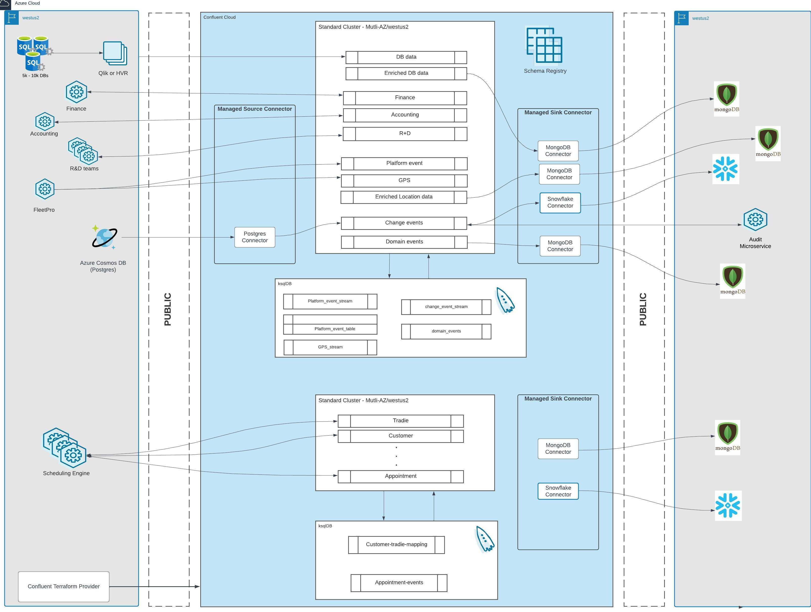
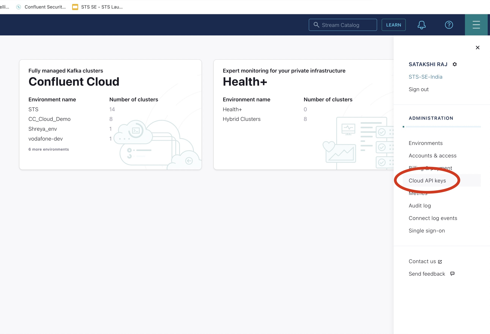
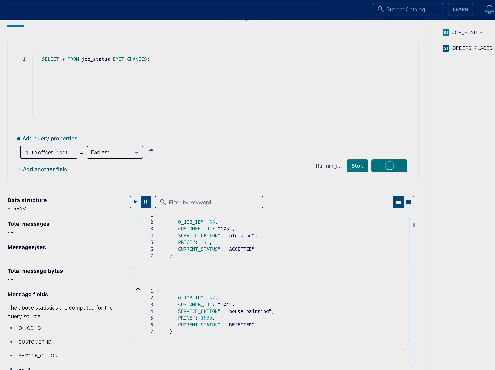
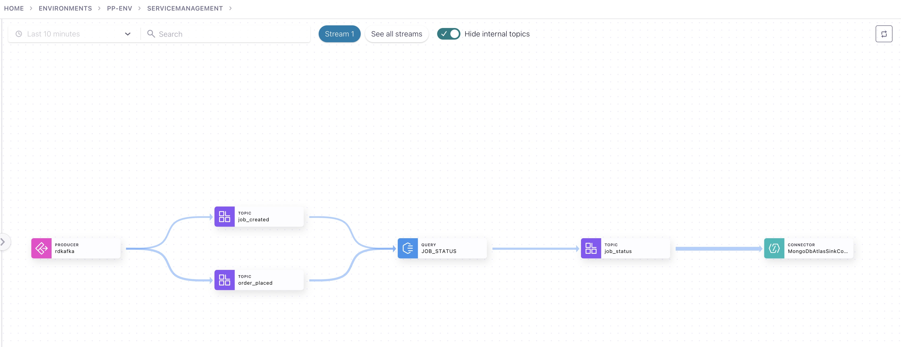

# service-management-platform

## Building a Dynamic Tradie Platform
Service Management softwares provides a unified platform to connect homeowners and businesses with trusted tradies and for tradies to manage their daily jobs and overcome any obstacle the day may bring. Service management software platforms have unveiled a new suite of powerful capabilities for trades business to optimize ROI and efficiency.These platforms deliver a seamlessly integrated experience that enable thousands of business owners to accelerate growth, drive operational efficiencies and deliver a superior customer experience. Customers can post trade jobs of any size, whether homeowners or commercial businesses, and tradies can pick these jobs based on their area of expertise, design productive workflows for these jobs, ensuring better profit margins. They can also empower their team at every part of the job cycle and use gathered data to make quick decisions, coach their team and impress customers by providing high quality deliverables. 

This demo outlines some of the use cases of a popular tool used in construction business detailing how Confluent Cloud, a managed Kafka solution is used as a centralized streaming platform for their event driven processing that supports the platform.

## Architecture Diagram



For this demo, we will utilize a Python client and write our producer in order to transmit records for the orders being placed and the jobs being created. Further, we will understand how ksqlDB can be used to perform transformations on the events. At the end, we will see how the data is consumed by a Sink Connector.

## Pre-requisites

Before we go ahead and start with the technical aspects, please make sure you have these pre-requisites in place. These are very essential to complete our demo successfully
 - Sign up for a Confluent Cloud account from [here](https://www.confluent.io/confluent-cloud/tryfree/)
 - Install Terraform, an infrastructure as code tool, from [here](https://developer.hashicorp.com/terraform/tutorials/aws-get-started/install-cli)
 - Install python. 
 - Install python modules using this command: pip3 install modulename


## Steps to follow

### Generate a Confluent Cloud API Key and Secret (Please do not get confused with Confluent Cloud Cluster API Key and Secret)
    
- After successfully signing up for and signing in to your Confluent Cloud account, click on the menu on the top-right.



- Generate the API Key and Secret. Download it as it will be used in this demo.

### Terraform to provision resources
- For this demo, we will be using a Terraform script to spin up the resources we need. Navigate to terraform/main.tf to get an overview of the resources we will be creating.
- Now, go to terraform/variables.tf and place the Confluent Cloud API Key and Secret we created in the last step within the quotation marks
- Navigate to the terraform directory and intialize terraform with the following command:
    `terraform init`
- Now, apply to create the infrastructure with this command:
    `terraform apply`
### Produce data using Python Clients
- For producing data to the Kafka cluster, navigate to the python folder. There are two producers we will be executing, that will produce data to two topics simultaneously. Before executing these files, update the following values in both the producer clients.
    
```
    BOOTSTRAP_SERVERS = ''  # Replace with your Confluent Cloud bootstrap servers
    SASL_USERNAME = ''  # Replace with your Confluent Cloud Cluster API key
    SASL_PASSWORD = ''  # Replace with your Confluent Cloud API Cluster secret
```

> Note: The Cluster API key differs from the Confluent Cloud API Key. The Confluent Cloud Cluster key and secret were created by the terraform script. For getting the secret, navigate to terraform/terraform.tfstate file, which gets created automatically after We initialialize Terraform, and search "secret"
     
- Execute the Python script using the following syntax:
`python3 file_name.py`
> Note: The command will depend on the python version installed

- Confluent has support for several high performing clients in many popular languages. Explore the Clients section inside your cluster.

### Stream Processing with ksqlDB

Now that your data is in motion, it’s time to make sense of it. Stream processing enables you to derive instant insights from your data streams, but setting up the infrastructure to support it can be complex. That’s why Confluent developed ksqlDB, the database purpose-built for stream processing applications. With ksqlDB, you can continuously transform, enrich, join, and aggregate your data using simple SQL-like syntax. 

In this demonstration, we will learn how topics are transformed to [Streams](https://www.confluent.io/blog/kafka-streams-tables-part-3-event-processing-fundamentals/), and data from two streams can be joined and filtered.

#### Steps to follow-
- Navigate to the ksqlDB cluster created in Confluent Cloud UI. Further, open the editor tab to start wrtiting the ksqlDB queries.

- At the bottom of the editor, set `auto.offset.reset` to `earliest`. This value determines the position (or offset) to start reading the data from.

- Create a stream `'orders_placed'` for the `'order_placed'` topic:
```
CREATE STREAM orders_placed (
 job_id BIGINT,
 customer_id VARCHAR,
 service_option VARCHAR,
 contractor_id VARCHAR,
 location VARCHAR,
 price_quoted BIGINT
) WITH (
 KAFKA_TOPIC='order_placed',
 VALUE_FORMAT='JSON'
);
```

- Create a stream `'jobs_created'` for the `'job_created'` topic:

CREATE STREAM jobs_created (
 job_id BIGINT,
 job_start_date VARCHAR,
 job_end_date VARCHAR,
 price BIGINT,
 job_status VARCHAR
) WITH (
 KAFKA_TOPIC='job_created',
 VALUE_FORMAT='JSON'
);

- Ensure the streams are properly created and are getting populated:
```
SELECT * FROM 'stream_name' EMIT CHANGES;
```

- Now, we will update the status of each job based on a condition. If the price quoted by the customer in the orders_placed topic is greater than or equal to the price mentioned in the job_created topic, the status of the job in the job_created topic will get updated to 'Accepted', else 'Rejected'.

```
CREATE STREAM job_status WITH (
     kafka_topic='job_status'
   ) as
SELECT 
 o.job_id,
 o.customer_id,
 o.service_option,
 j.price,
 CASE WHEN o.price_quoted >= j.price THEN 'ACCEPTED' 
      ELSE 'REJECTED' END as current_status
 from jobs_created as j
 INNER JOIN orders_placed as o
 WITHIN 1 hour
 on o.job_id = j.job_id
 EMIT CHANGES;
 ```
- Query the result stream:
```
SELECT * FROM 'job_status' EMIT CHANGES;
```


- With ksqlDB, we can also provide real-time visibility into a customer's tradie location status to help ensure jobs are fulfilled in a timely manner. However, aggregating data from multiple different data sources and continuously processing it in real time as locations change can be rather daunting. Let us see a simple way to do that!
    - Create two topics 'tradie_truck' and 'joblocation' with 6 partitions and insert mock data to it. You can modify the existing producer code we have, and explore more.

    - Create a Table and a Stream with the topics you just created:
    ```
    CREATE TABLE JOBLOCATION (
    ID VARCHAR PRIMARY KEY,
    CUSTOMERNAME VARCHAR,
    EMAIL VARCHAR,
    ADDRESS VARCHAR,
    DEST_LAT DOUBLE,
    DEST_LONG DOUBLE,
    REPORTING_TIME BIGINT
    ) WITH (
    KAFKA_TOPIC = 'joblocation',
    VALUE_FORMAT = 'JSON',
    KEY_FORMAT = 'KAFKA',
    PARTITIONS = 6
    );
    ```
    ```
    CREATE STREAM VEHICLES (
    ID VARCHAR KEY,
    JOB_ID VARCHAR,
    STATE VARCHAR,
    LAT DOUBLE,
    LONG DOUBLE
    ) WITH (
    KAFKA_TOPIC = 'tradie_truck_location',
    VALUE_FORMAT = 'JSON',
    KEY_FORMAT = 'KAFKA',
    PARTITIONS = 6
    );
    ```
    -  Create a truck tracking table for vehicle location and ETA. Ensure the topic 'truck_tracker' is created in Confluent Cloud.

    ```
    CREATE TABLE TRUCK_TRACKER WITH (
    KAFKA_TOPIC = 'truck_tracker',
    PARTITIONS = 6
    ) AS
    SELECT
    J.ID JOB_ID,
    LATEST_BY_OFFSET(V.ID) VEHICLE_ID,
    LATEST_BY_OFFSET(V.LAT) LAT,
    LATEST_BY_OFFSET(V.LONG) LONG,
    LATEST_BY_OFFSET(J.DEST_LAT) DEST_LAT,
    LATEST_BY_OFFSET(J.DEST_LONG) DEST_LONG,
    LATEST_BY_OFFSET(ROUND(GEO_DISTANCE(CAST(V.LAT as DOUBLE), CAST(V.LONG as DOUBLE), CAST(J.DEST_LAT as DOUBLE), CAST(J.DEST_LONG as DOUBLE), 'KM'), 2)) DISTANCE_FROM_DESTINATION,
    LATEST_BY_OFFSET(ROUND(GREATEST(ABS(V.LAT - O.DEST_LAT), ABS(V.LONG - O.DEST_LONG)) / (0.5 / 10 / 10) * 2, 2)) ETA_SECONDS
    FROM VEHICLES AS V
    JOIN JOBLOCATION AS J
    ON ((V.JOB_ID = J.ID))
    GROUP BY J.ID
    EMIT CHANGES;
    ```
    - Fetch latest location data from truck tracking table:
    SELECT * from TRUCK_TRACKER;

### Sink Messages from Confluent Cloud to MongoDB

With Confluent Cloud, you have the option of writing your own consumers using clients. However, for this demonstration, we will be integration with an external system using a Sink Connector in Confluent CLoud.

- In Confluent Cloud, navigate to the Connectors section. Confluent has a library of over 200 [Connectors](https://docs.confluent.io/cloud/current/connectors/index.html), more than half of which are Confluent developed and supported. In this demo, we will be utilizing the MongoDB Atlas Sink Connector.

- In the next step, choose the 'job_status' topic we created to fetch if the request has been accepted or rejected.

- Now, use the existing Confluent Cloud Cluster API Key and Secret.

- Next, fill in the required field such as the hostname, the collection name, the database, the username and the password.

- Choose the Input Kafka record value format as JSON here.

- Configure the number of tasks, review the configuration and launch.

> For this demo, please ensure that the  MongoDB Cluster is public by adding 0.0.0.0/0 in Network Access Section.

- Once the connector is up and running, the messages will get consumed and start displaying in the mentioned database.


### Visualize Real-Time Data Streams with Stream Lineage

Stream Lineage helps us in observing the movement of your data streams in real time- where did the data come from, where is it going, and what processing is happening in the motion. It helps in 
understanding complex data relationships and uncover more insights all with a visual representation of your data flow. You can also access real-time performance & health metrics directly alongside every pipeline.



### Congratulations! Your Service Management demo is now successfully completed. 

### Teardown

- It is a good practice to delete any resources that were created to prevent additional charges and save on infrastructure cost. Navigate to the terraform directory and execute the command:

`terraform apply -destroy`

## Self- Enablement

- All About [Kafka Connect](https://docs.confluent.io/cloud/current/connectors/index.html)

- Introduction to [ksqlDB](https://docs.confluent.io/cloud/current/ksqldb/overview.html)

- [Stream Governance](https://docs.confluent.io/cloud/current/stream-governance/index.html) with Confluent Cloud

- [Deep Dive on Apache Kafka](https://developer.confluent.io/)
